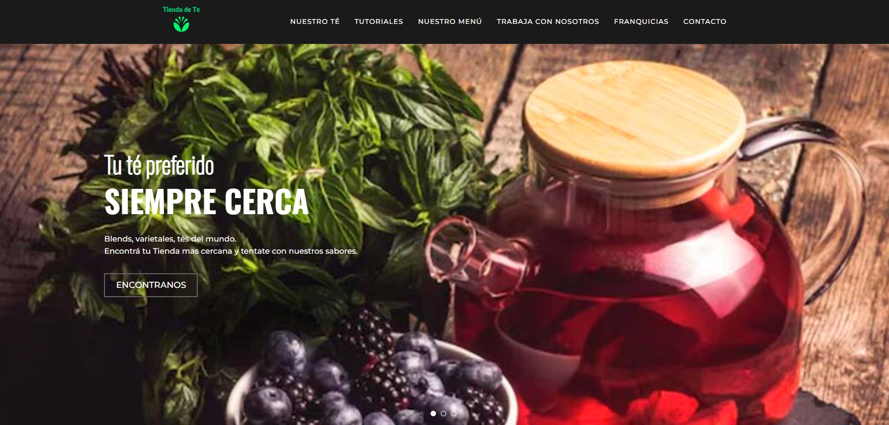

# **Trabajo práctico grupal "Tienda de Té"**

## **Descripción del proyecto.**

### Nuestro objetivo fue mantener lo mas fielmente el modelo de la tienda de café para con ello demostrar dominio en HTML y CSS. Tamién se agrego varios archivos javascript con la finalidad de resolver las animaciones mas complejas, inyectar el header y el footer para no repetir codigo y reutilizar algunos elementos. Tambien hicimos una importacion de las variables en cada CSS para centralizar su modificacion, mismo motivo por el cual también inyectamos el header y el footer.

## **Metodología de trabajo.** 

### El trabajo grupal se resolvio con un repositorio compartido y distribución de tareas bien definida para evitar conflictos. Coordinamos las fases iniciales del proyecto para definir variables de css y acordar la metodologia de trabajo; luego cada uno fue haciendo su aporte significativo. Finalmente ajustamos detalles para maximizar la coherencia del proyecto.

## Conclusiones.

### Todos los integrantes del grupo quedamos conformes con el resultado final y en especial por la dinámica de trabajo grupal que funcionó impecablemente.
